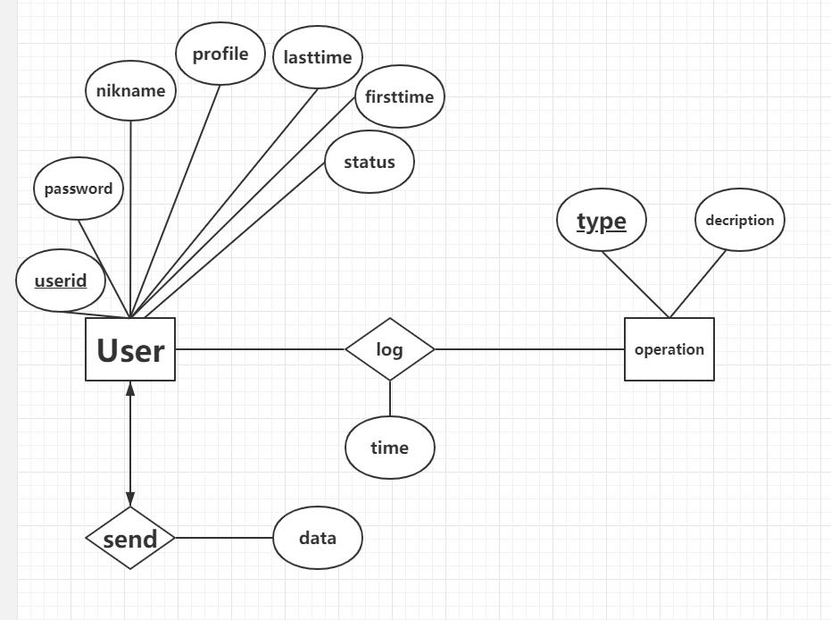

# WebChat

## Backbone

项目使用Maven构建,后端使用的JAVA EE
主要框架为Spring + Spring MVC + Mybatis
Webserver: [Tomcat 9.0.26](http://tomcat.apache.org/)
数据库使用的是[MySQL 5.7.27](http:/www.mysql.org/)
前端采用[Amaze UI](http://amazeui.org/),弹窗和分页使用的是[Layer](www.layui.com),当然还有[Jquery](http://jquery.com/)
开发工具使用的是[IntelliJ IDEA](http://www.jetbrains.com/idea/)

## E-R diagram



## PIPELINE

## Communication Protocol

### WebSocket

WebSocket 是 HTML5 开始提供的一种在单个 TCP 连接上进行全双工通讯的协议。

WebSocket 使得客户端和服务器之间的数据交换变得更加简单，允许服务端主动向客户端推送数据。在 WebSocket API 中，浏览器和服务器只需要完成一次握手，两者之间就直接可以创建持久性的连接，并进行双向数据传输。

### 数据交互格式

在WebChat中定义的前后台数据交换格式如下:

```json

"message" : {
	"from" : "xxx",
	"to" : "xxx",
	"content" : "xxxxxx",
	"time" : "xxxx.xx.xx"
},
"type" : {
	"xxx"
},
"list" : {
	["xx","xx"]
}
```

其中,**message**是消息部分,from是发信人用户名,to是收信人用户名(如果是群聊则置空),content是消息内容,time是发送时间,这里发信时间是前台JS获取,from和to都是直接用户名

type是消息类型,分为两种,notice和message.notice是提示类型,比如xxx用户加入了聊天室,xxx用户离开了聊天室;message是消息类型,就是用户之间发送的消息

list是当前在线的用户名的列表,只在后台触发onopen和onclose时返回list,然后更新前台的在线列表,实现实时的列表展示

## 实现功能

- 用户登录,注册
- 用户信息展示
- 用户信息修改
- 修改密码
- 在线聊天
- 在线列表展示
- 群聊和私聊
- 日志记录展示等.
